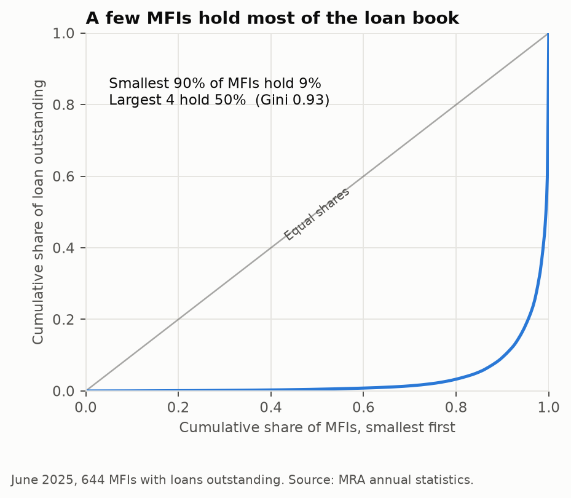
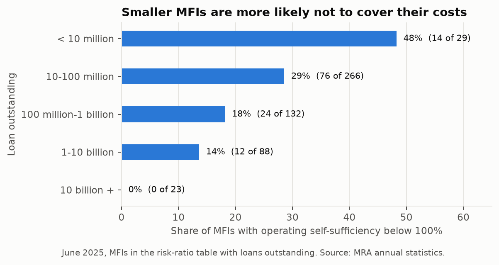
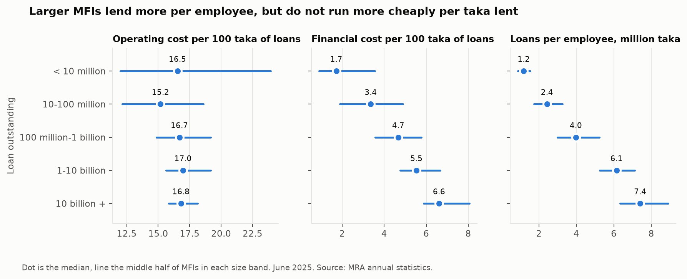
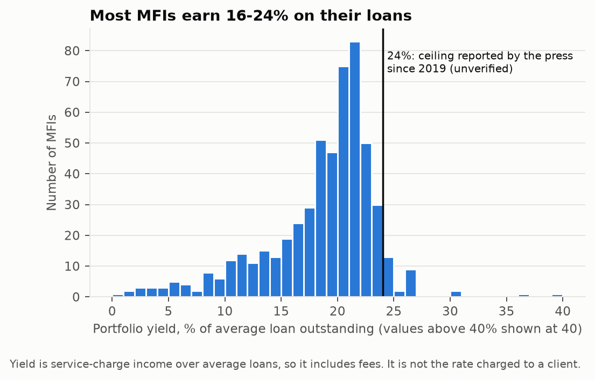
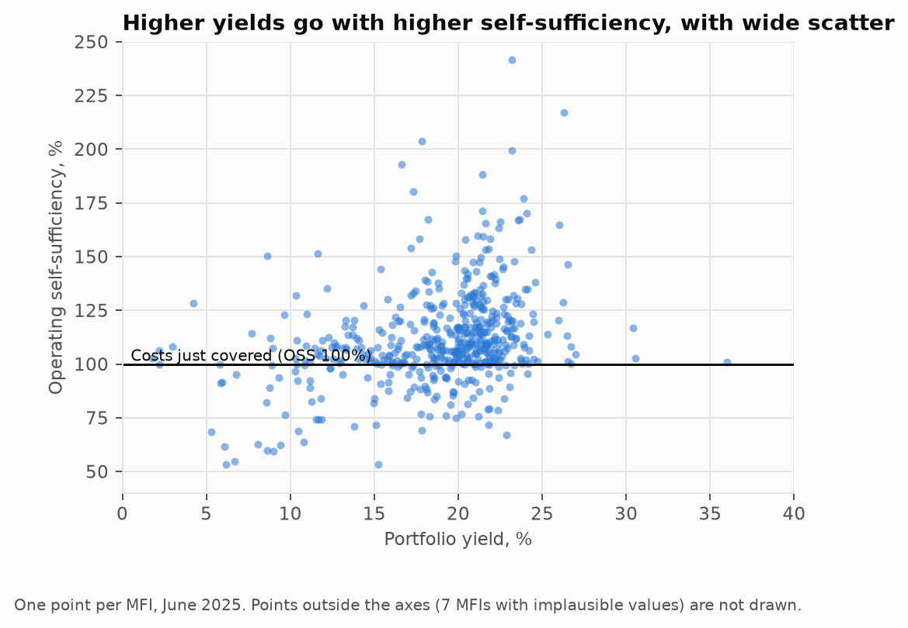
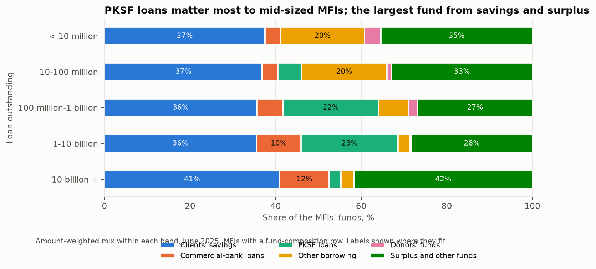
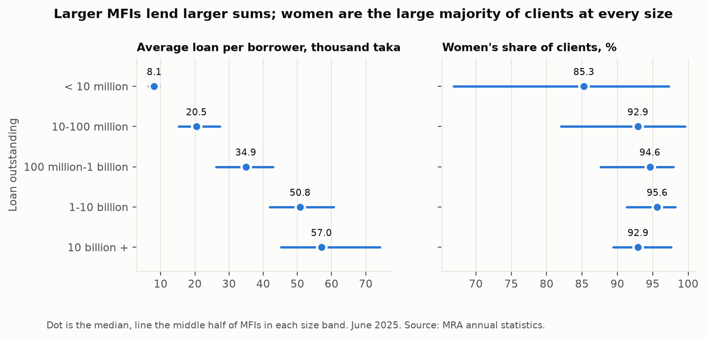
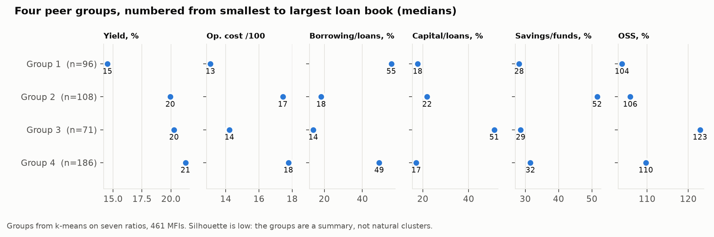
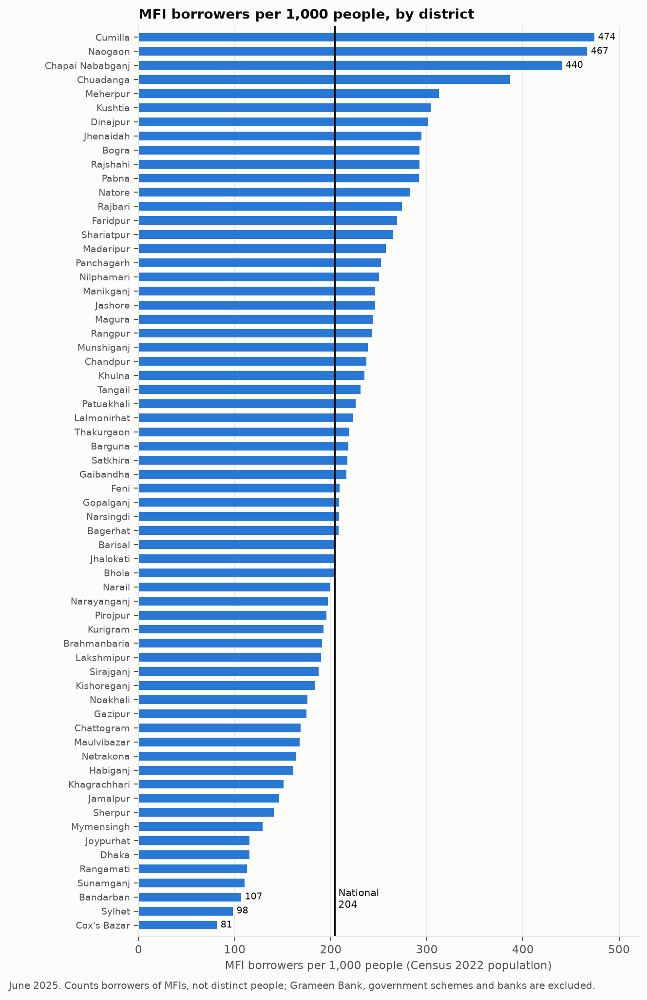

# Results: the Bangladesh microfinance sector in June 2025

Phase MF2. Every number below is computed by `make analyse` from the extracted MRA tables in
`data/real/processed/` and the Census 2022 district populations. Nothing here uses synthetic
data. The tables behind each figure are in [`results/tables/`](results/tables/).

## Read this first: who is counted

The Basic table lists 693 MFIs. 40 of them have no figures at all, and
9 more report no loans or no borrowers, so **644 MFIs are analysed** ("active": loans
outstanding and borrowers both above zero). Together they hold 1,748.7 billion taka of loans (the report prints 1,748.8 billion for the sector; the per-MFI rows sum to slightly less, see the extraction notes).
The ratio tables cover fewer of them, and each analysis says which:

| Table | Active MFIs covered | Share of loan outstanding |
|---|---:|---:|
| Basic (loans, borrowers, savings, staff) | 644 | 100% |
| Operating cost ratios | 586 | 97.1% |
| Risk ratios (yield, OSS, ROA, borrowing) | 538 | 94.8% |
| Fund composition | 555 | 95.9% |

Amounts are taka. "Size" means loan outstanding. Medians describe a typical MFI (each counts once);
"weighted" or "sector" figures add the numerators and denominators across MFIs, so large MFIs dominate.

## 1. Concentration

| Measure | MFIs | Top 1 % | Top 4 % | Top 10 % | HHI | Gini |
|---|---:|---:|---:|---:|---:|---:|
| Loan outstanding | 644 | 24.6 | 50.5 | 63.8 | 957 | 0.93 |
| Borrowers | 644 | 22.2 | 50.6 | 61.1 | 904 | 0.91 |
| Savings | 642 | 33.6 | 55.4 | 68.3 | 1,376 | 0.94 |
| Branches | 644 | 11.5 | 32.3 | 46.6 | 373 | 0.85 |
| Employees | 641 | 19.7 | 39.5 | 53.7 | 607 | 0.89 |

BRAC, ASA, BURO Bangladesh and TMSS hold 50.5% of loan outstanding and 50.6% of borrowers. BRAC alone holds 24.6%
of the loan book. The Gini coefficient is 0.93: the smallest 90% of MFIs together hold 9% of the loans. The HHI
(957) looks low only because the rest of the sector is split across hundreds of small MFIs; the top-4 share and the Gini
describe this sector better. Savings are more concentrated than loans (top 4 hold 55.4%), branches less (32.3%).

## 2. Sustainability

| Loan outstanding | MFIs | Median OSS % | Median ROA % | OSS < 100 | % OSS < 100 | % ROA < 0 |
|---|---:|---:|---:|---:|---:|---:|
| < 10 million | 29 | 102.1 | 0.7 | 14 | 48.3 | 24.1 |
| 10-100 million | 266 | 106.1 | 1.1 | 76 | 28.6 | 12.8 |
| 100 million-1 billion | 132 | 111.1 | 2.1 | 24 | 18.2 | 9.1 |
| 1-10 billion | 88 | 110.0 | 2.6 | 12 | 13.6 | 3.4 |
| 10 billion + | 23 | 113.1 | 2.6 | 0 | 0.0 | 0.0 |

Operating self-sufficiency (OSS) below 100 means an MFI does not cover its costs from its own income. 126 of 538
MFIs (23.4%) are below 100, yet they hold only 2.3% of the loans: the problem is
concentrated among small institutions. 48% of the smallest MFIs are below 100, against 0%
of the 23 largest. The median MFI has an OSS of 108.0 and a return on assets of 1.6%
(56 MFIs have negative ROA).

| Factor | Median, OSS < 100 | Median, OSS ≥ 100 | Rank corr. with OSS | MFIs |
|---|---:|---:|---:|---:|
| Loan outstanding (BDT) | 32,372,452.0 | 100,437,105.5 | 0.23 | 538 |
| Portfolio yield (%) | 17.2 | 20.5 | 0.36 | 538 |
| Operating cost per 100 taka of loans | 18.2 | 15.8 | -0.37 | 538 |
| Borrowing to loan outstanding (%) | 48.4 | 36.7 | -0.19 | 487 |
| Capital fund to loan outstanding (%) | 16.2 | 22.2 | 0.34 | 538 |
| Clients' savings share of funds (%) | 33.9 | 34.9 | -0.04 | 529 |

MFIs below 100 are smaller (median loans 32 million taka against 100 million),
earn a lower yield (17.2% against 20.5%), spend more per 100 taka lent
(18.2 against 15.8), rely more on borrowing
(48.4% against 36.7% of loans) and hold a thinner capital cushion
(16.2% against 22.2%). The share of funds from clients' savings does not separate the two groups
(rank correlation -0.04). Two cautions: yield and operating cost are inputs to OSS, so their link to it is partly
built in; and these are associations across institutions, not causes.

## 3. Efficiency and scale

| Loan outstanding | MFIs | Op. cost /100 taka | Financial cost /100 taka | Borrowers per employee | Borrowers per branch | Loans per employee (BDT) | Op. cost per borrower (BDT) |
|---|---:|---:|---:|---:|---:|---:|---:|
| < 10 million | 47 | 16.5 | 1.7 | 160 | 558 | 1,187,136 | 1,292 |
| 10-100 million | 326 | 15.2 | 3.4 | 113 | 631 | 2,429,007 | 3,187 |
| 100 million-1 billion | 153 | 16.7 | 4.7 | 116 | 736 | 3,972,864 | 5,997 |
| 1-10 billion | 94 | 17.0 | 5.5 | 121 | 925 | 6,142,913 | 8,503 |
| 10 billion + | 24 | 16.8 | 6.6 | 122 | 1,127 | 7,406,370 | 10,084 |

Scale economies do not show up in cost per taka lent. The rank correlation between size and operating cost per 100 taka is 0.21 (a weak positive relationship),
and the median sits between 15.2 and 17.0 in every band. Financial cost per 100 taka (interest on savings and on borrowing) rises with size (0.50).
What does rise with size is lending per employee (correlation 0.76), because loans get larger, not because staff
serve more people: borrowers per employee show no relationship with size (0.00). Cost per
borrower rises with size for the same reason. These are ratios of published totals; staff counts are as reported by each MFI.

## 4. Pricing

Across 538 MFIs the median portfolio yield is 20.0% (middle half 16.5% to 21.6%; loan-weighted average
21.6%). 28 MFIs (5.2%), holding 1.1% of the loans, report a yield above
24%. That figure is only a reference line: the press has reported a 24% ceiling since 2019 (see the caveats), MRA's own notification was not found, and
portfolio yield is service-charge income over average loans, so it includes fees and is not the declining-balance rate a client pays. It cannot show
whether any MFI breaches a limit.

| Loan outstanding | MFIs | Median yield % | % above 24 |
|---|---:|---:|---:|
| < 10 million | 29 | 13.3 | 13.8 |
| 10-100 million | 266 | 18.1 | 4.9 |
| 100 million-1 billion | 132 | 20.6 | 4.5 |
| 1-10 billion | 88 | 21.4 | 5.7 |
| 10 billion + | 23 | 21.3 | 0.0 |

Yield and self-sufficiency move together (rank correlation 0.36), and yield moves with the cost ratio too
(0.57): MFIs with higher costs tend to charge more, and higher yields go with higher OSS, but the scatter is wide.

## 5. Funding mix

| Source of funds | Share Jun 2024 % | Share Jun 2025 % | Change, points | Amount Jun 2025 (BDT) | Amount change % |
|---|---:|---:|---:|---:|---:|
| Clients' savings | 38.5 | 39.8 | +1.3 | 761,555,338,801 | +16.2 |
| Commercial-bank loans | 14.1 | 11.2 | -2.9 | 214,982,496,872 | -10.3 |
| PKSF loans | 6.4 | 6.8 | +0.4 | 130,998,861,888 | +19.4 |
| Other borrowing | 2.4 | 3.2 | +0.8 | 60,479,057,320 | +51.2 |
| Donors' funds | 0.2 | 0.2 | +0.0 | 3,298,931,809 | -1.9 |
| Surplus and other funds | 38.4 | 38.8 | +0.4 | 743,593,699,200 | +13.8 |

Over the 555 MFIs with a fund-composition row, clients' savings are 39.8% of funds and surplus and other own funds
38.8%; commercial-bank loans fell from 14.1% to 11.2% of funds
(-10.3% in taka) while savings grew 16.2% and PKSF loans 19.4%.
A typical MFI draws 35% of its funds from clients' savings. 205 MFIs have commercial-bank loans and 37 of them
(6.7% of the 555) get a quarter or more of their funds from banks, together holding 21.5% of loans. Between the two
years, 10 MFIs raised their bank-loan share by 10 points or more and 19 cut it by as much.

## 6. Outreach

| Loan outstanding | MFIs | Avg loan (BDT) | Savings per client (BDT) | Women % of clients | Borrowers % of clients |
|---|---:|---:|---:|---:|---:|
| < 10 million | 47 | 8,113 | 1,912 | 85.3 | 78.0 |
| 10-100 million | 326 | 20,470 | 4,774 | 92.9 | 75.0 |
| 100 million-1 billion | 153 | 34,898 | 8,814 | 94.6 | 72.7 |
| 1-10 billion | 94 | 50,792 | 14,199 | 95.6 | 74.8 |
| 10 billion + | 24 | 57,022 | 20,609 | 92.9 | 79.5 |

The sector-wide average loan is 51,927 taka per borrower, but the typical MFI's is 26,515 (middle half
16,645 to 40,056); the large MFIs pull the average up. Clients hold 18,177 taka of savings on average
(45.7% of loans outstanding). Women are 91.0% of clients and 91.2% of borrowers;
402 MFIs are at least 90% women and 12 are under half. The report counts 364 third-gender clients and
253 third-gender borrowers. 76.6% of members have a loan.

## 7. Data quality

The published tables have gaps and inconsistencies, listed in full in [docs/extraction-notes.md](docs/extraction-notes.md). Beyond those, plausibility
checks catch values that are probably entry errors. Counts only; no institution is named.

| Check | MFIs checked | Flagged | Share of loans held by flagged % |
|---|---:|---:|---:|
| Portfolio yield outside 3% to 40% | 538 | 7 | 0.02 |
| OSS outside 40% to 250% | 538 | 13 | 0.02 |
| ROA outside -25% to 25% | 538 | 3 | 0.00 |
| Operating cost above 50 per 100 taka of loans | 586 | 3 | 0.00 |
| More than 1,000 borrowers per employee | 641 | 7 | 0.21 |
| Average loan below 5,000 or above 250,000 taka | 644 | 9 | 0.01 |

Flagged MFIs hold a very small share of loans, so they matter little for sector totals but would distort averages, which is why the medians above
are preferred and the peer groups below exclude them.

## 8. Peer groups and a screening rule

| Group | MFIs | % of loans | Median loans (BDT) | Median avg loan (BDT) | Yield % | Op. cost /100 | Borrowing/loans % | Savings/funds % | OSS % | % OSS < 100 |
|---:|---:|---:|---:|---:|---:|---:|---:|---:|---:|---:|
| 1 | 96 | 0.4 | 22,967,618 | 17,766 | 14.5 | 13.1 | 55.1 | 28.2 | 103.9 | 37.5 |
| 2 | 108 | 0.8 | 60,099,112 | 22,224 | 19.9 | 17.4 | 18.3 | 51.6 | 105.9 | 23.1 |
| 3 | 71 | 18.6 | 64,352,261 | 29,560 | 20.3 | 14.2 | 14.2 | 28.6 | 122.8 | 7.0 |
| 4 | 186 | 80.2 | 1,070,951,519 | 42,840 | 21.3 | 17.8 | 48.8 | 31.5 | 109.7 | 16.1 |

Capital fund to loans, the seventh ratio, is in [`08_peer_groups.csv`](results/tables/08_peer_groups.csv) and the figure.

K-means on seven standardised ratios (size, loan size, yield, operating cost, borrowing, capital, savings share) over 461 MFIs with a complete
set and no implausible value gives 4 groups (best silhouette among 2 to 6 groups: 0.24). A silhouette that low means the structure is weak: the groups
are a convenient summary of how MFIs differ, not natural clusters. What sets each group apart (median against the median of all groups):

- **Group 1** (96 MFIs, 0.4% of loans): yield 14.5 (all MFIs 20.2); operating cost per 100 taka 13.1 (all MFIs 16.4)
- **Group 2** (108 MFIs, 0.8% of loans): savings share of funds 51.6 (all MFIs 34.5); borrowing to loans 18.3 (all MFIs 37.2)
- **Group 3** (71 MFIs, 18.6% of loans): capital fund to loans 51.1 (all MFIs 21.0); OSS 122.8 (all MFIs 108.6)
- **Group 4** (186 MFIs, 80.2% of loans): average loan (BDT) 42,839.6 (all MFIs 29,798.6); borrowing to loans 48.8 (all MFIs 37.2)

**Screening rule.** MFIs with OSS below 100 and borrowing at or above 50% of loans number 50 of 538
(9.3%); together they hold 1.3% of the loans, and their median loan book is 42 million
taka. This is a filter on financial-structure ratios. It says nothing about delinquency, which MRA publishes only for the sector as a whole, and it is not a
finding about any named institution, so no list is published.

## 9. Geography

| Division | Population (Census 2022) | MFI borrowers | Borrowers per 1,000 | Loans per person (BDT) |
|---|---:|---:|---:|---:|
| Rajshahi | 20,353,116 | 5,550,209 | 273 | 12,049 |
| Khulna | 17,415,924 | 4,536,688 | 260 | 11,520 |
| Rangpur | 17,610,955 | 4,247,169 | 241 | 9,573 |
| Barishal | 9,100,104 | 1,897,977 | 209 | 9,936 |
| Chattogram | 33,202,357 | 6,229,146 | 188 | 11,884 |
| Dhaka | 44,215,759 | 8,089,242 | 183 | 11,426 |
| Mymensingh | 12,225,449 | 1,719,982 | 141 | 6,296 |
| Sylhet | 11,034,952 | 1,411,656 | 128 | 6,090 |

Nationally there are 204 MFI borrowers per 1,000 people, but districts range from 81 to 474.
Highest: Cumilla (474), Naogaon (467), Chapai Nababganj (440), Chuadanga (387), Meherpur (313). Lowest: Cox's Bazar (81), Sylhet (98), Bandarban (107), Sunamganj (111), Rangamati (113). By division, Rajshahi is highest (273) and
Sylhet lowest (128). Sunamganj ranks 61 of 64 from the top. Across districts, MFI borrowers per 1,000 people
have a moderate positive relationship with the share of people holding a financial-institution account in the census (rank correlation
0.47) and a weak positive relationship with mobile-banking accounts (0.25). Borrowers are counts of loans
held with MFIs, not distinct people, and the population is everyone, not adults; use the ranking, not the level.

## Limits and caveats

- **Real data only, and only what MRA publishes.** No per-MFI delinquency, no client-level data, nothing on Grameen Bank's own accounts beyond MRA's sector series.
- **Denominators differ by table** (see the top). Findings on ratios describe the MFIs that report them.
- **Associations, not causes.** Rank correlations and group medians describe how measures move together across institutions.
- **The 24% reference.** The press has reported a 24% ceiling on microcredit interest since 2019, with later proposals to lower it ([Financial Express, 2021](https://thefinancialexpress.com.bd/economy/bangladesh/microcredit-regulator-forms-committee-to-cut-microloan-interest-rates-1614393568)). MRA's own notification was not located and the current value is unconfirmed, so it is used only as a reference line.
- **Census population** is the 2022 Census district table from BBS, as published on the Humanitarian Data Exchange under CC0. The report date is June 2025.
- **Not yet done:** trends over time and the June 2024 comparison (phase MF3).

Reproduce everything with `make analyse`.
